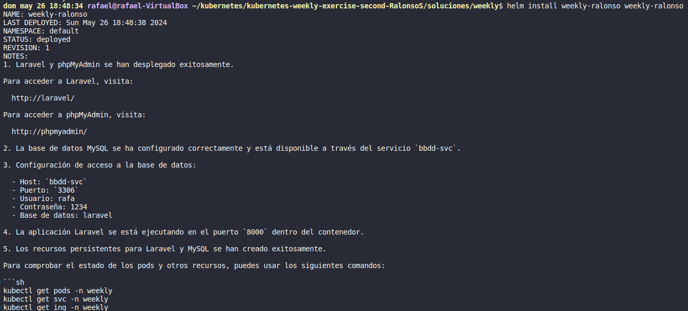
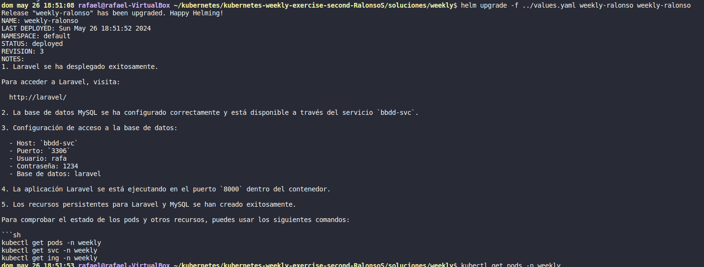
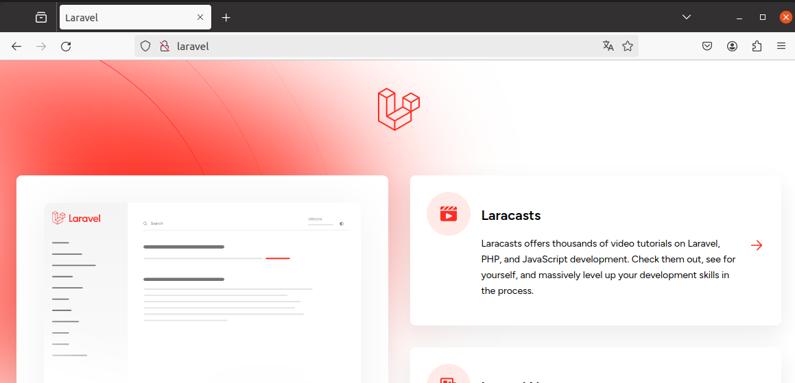
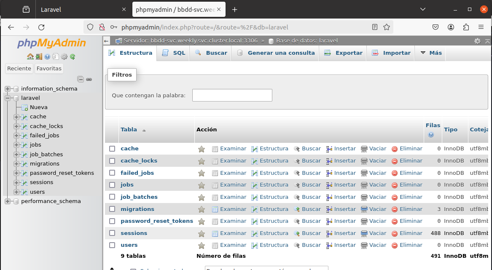
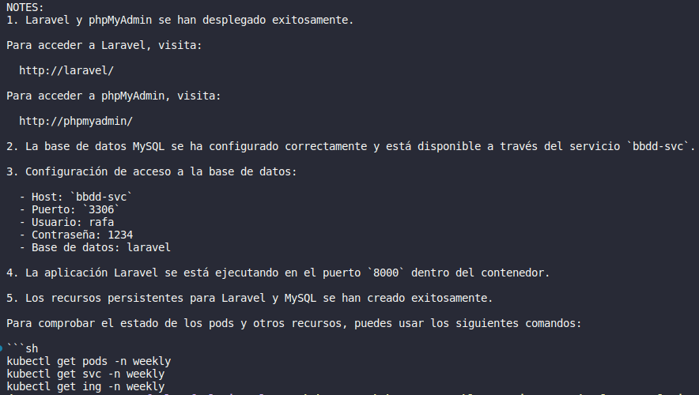

# Ejercicio semanal

## Descripción del Proyecto

Este proyecto proporciona un Helm chart para desplegar una aplicación Laravel, una base de datos MySQL y opcionalmente phpMyAdmin en un clúster de Kubernetes. La configuración es altamente personalizable, permitiendo ajustes en los recursos, almacenamiento persistente, y configuraciones de red.

## Configuración del values.yaml

### Laravel

- `laravel.tag`: Especifica la etiqueta de la imagen de Docker para Laravel.
- `laravel.resources.requests`: Configura las solicitudes de recursos.
- `laravel.resources.limits`: Configura los límites de recursos.

### MySQL

- `mysql.tag`: Especifica la etiqueta de la imagen de Docker para MySQL.
- `mysql.resources.requests`: Configura las solicitudes de recursos.
- `mysql.resources.limits`: Configura los límites de recursos.

### phpMyAdmin (opcional)

- `withPhpmyadmin`: Habilita o deshabilita la instalación de phpMyAdmin.
- `phpmyadmin.tag`: Especifica la etiqueta de la imagen de Docker para phpMyAdmin.
- `phpmyadmin.resources.requests`: Configura las solicitudes de recursos.
- `phpmyadmin.resources.limits`: Configura los límites de recursos.

### Ingress

- `ingresslaravel.host`: Configura el host para el recurso de Ingress de Laravel.
- `ingresslaravel.path`: Configura el path para el recurso de Ingress de Laravel.
- `ingressphpmyadmin.host`: Configura el host para el recurso de Ingress de phpMyAdmin (opcional).
- `ingressphpmyadmin.path`: Configura el path para el recurso de Ingress de phpMyAdmin (opcional).

### Almacenamiento Persistente

- `persistentVolumes.mysql.hostpath`: Ruta en el host para el almacenamiento persistente de MySQL.
- `persistentVolumes.mysql.storage`: Tamaño del volumen persistente de MySQL.
- `persistentVolumes.mysql.requestStorage`: Tamaño de la solicitud de almacenamiento persistente de MySQL.
- `persistentVolumes.laravel.hostpath`: Ruta en el host para el almacenamiento persistente de Laravel.
- `persistentVolumes.laravel.storage`: Tamaño del volumen persistente de Laravel.
- `persistentVolumes.laravel.requestStorage`: Tamaño de la solicitud de almacenamiento persistente de Laravel.

## Instalación con valores por defecto:

## Actualización con uno de los ficheros values.yaml de ejemplo:

## Acceso a Laravel

## Acceso a PhpMyAdmin

### En las notas del chart se explica como acceder a los diferentes recursos del proyecto

